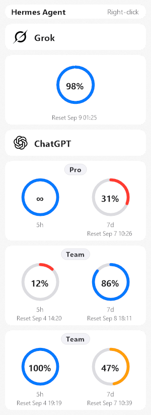
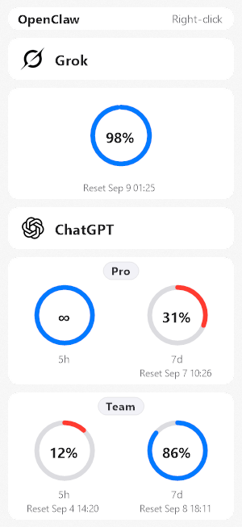
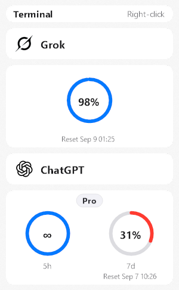

# grok-gpt-hud

[中文](README.zh-CN.md) | **English**

Windows always-on-top HUD for **read-only** SuperGrok and ChatGPT/Codex quota. Grok on top, ChatGPT below. UI language: **English** (default) or 中文, switched from the right-click menu; drawn text is one pixel larger for readability.

Single-file `grok-gpt-hud.exe` reads credentials, refreshes tokens in memory, fetches quota, and paints the UI. Needs the [.NET 8 Desktop Runtime](https://dotnet.microsoft.com/download/dotnet/8.0), HTTPS, and signed-in credentials for at least one source below.

- Borderless, optional always-on-top, tray icon (no taskbar button)
- Edge snap on mouse release (window’s monitor); drag does not resize/move from refresh
- Never writes tokens; never modifies `auth.json`, OpenClaw SQLite, or CLI / Hermes files

## Screenshots

| Hermes Agent | OpenClaw | Windows Terminal |
| --- | --- | --- |
|  |  |  |

## License

[MIT License](LICENSE)

## Stack

| Layer | Detail |
| --- | --- |
| Runtime | .NET 8 WinForms (`net8.0-windows`) |
| Publish | `win-x64` framework-dependent single file → `dist/grok-gpt-hud.exe` |
| UI | Owner-drawn cards + DWM acrylic; logos in `QuotaHud/Brand/` |
| Credentials | Right-click: **Hermes Agent** / **Windows Terminal** / **OpenClaw** |
| Quota | Parallel HTTPS GET for Grok and ChatGPT |
| Settings | `%APPDATA%\QuotaHud\settings.json` (source, locale, hidden accounts, always-on-top) |

Entry: `QuotaHud/Program.cs` → `HudForm`.

## Credential paths (read-only)

One source switch applies to both sides. If the current source has no files on either side, the app falls back to another source that has credentials and remembers it.

Environment overrides: `HERMES_HOME`, `OPENCLAW_HOME`, `QUOTA_WIDGET_HOME`.

### Hermes Agent (default)

`%LOCALAPPDATA%\hermes\auth.json`

- ChatGPT: `credential_pool["openai-codex"]` (same `access_token` → one card)
- SuperGrok: `credential_pool["xai-oauth"]`

### Windows Terminal

| Side | Path |
| --- | --- |
| ChatGPT / Codex | `%USERPROFILE%\.codex\auth.json` |
| SuperGrok | `%USERPROFILE%\.grok\auth.json` |

Parse order per side: pool → `accounts` → CLI singleton / map.

### OpenClaw

`%USERPROFILE%\.openclaw\state\openclaw.sqlite` → `config_machine_state` / `authProfiles.store`

- `provider=openai` → ChatGPT
- `provider=xai` → SuperGrok

Cards omit Grok `device_code` and ChatGPT emails. Hide accounts from the context menu.

## Refresh

- Immediate fetch on startup
- Every **5 minutes**, check whether to auto-poll
- Auto-poll only if local time is **09:00 ≤ hour &lt; 18:00** and ≥ **15 minutes** since the last auto-poll
- **Refresh now** ignores the work window

Expired access tokens with a `refresh_token` are renewed in memory via OpenAI or xAI OAuth.

## Quota display

- ChatGPT `wham/usage`: **5h** / **7d** rings (`∞` when uncapped)
- SuperGrok billing credits: remaining-percent ring
- Colors by remaining: ≥67% blue, 33–67% yellow, &lt;33% red
- ChatGPT plan badges: Go / Plus / Pro / Team / Business / Enterprise / Edu

## Build

```bash
dotnet publish QuotaHud/QuotaHud.csproj -c Release -r win-x64 --self-contained false -p:PublishSingleFile=true -o dist
```

Output: `dist/grok-gpt-hud.exe` (not committed). Dev: `dotnet run --project QuotaHud/QuotaHud.csproj`.
